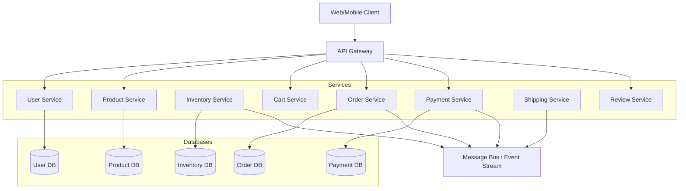

# 4주차: 실습 - 복잡한 문제 구조화하기

## 개요

지난 주까지 우리는 고급 컴퓨팅 사고와 소프트웨어 아키텍처의 이론을 학습했습니다. 이번 주에는 이를 실제로 적용하는 실습에 집중합니다. 복잡한 시스템을 어떻게 관리 가능한 조각으로 나누고, 각 조각 간의 관계를 어떻게 설계하며, GitHub Copilot과 협업하여 어떻게 구체화하는지 배웁니다.

**이번 주 학습 목표:**

1. **대규모 시스템 분해 능력 습득**: 복잡한 비즈니스 문제를 독립적이고 관리 가능한 블록으로 나누는 방법을 익힙니다.

2. **도메인 주도 설계(DDD) 실천**: 비즈니스 도메인을 중심으로 시스템을 설계하는 DDD의 핵심 개념을 이해하고, AI와 함께 도메인 모델을 만듭니다.

3. **마이크로서비스 아키텍처 적용**: 모놀리식 시스템을 마이크로서비스로 분해하는 실전 전략을 학습하고, 서비스 간 통신 패턴을 설계합니다.

4. **실전 프로젝트 경험**: 온라인 쇼핑몰이라는 현실적인 예제를 통해, 요구사항 분석부터 아키텍처 설계까지 전 과정을 GitHub Copilot과 협업하며 완성합니다.

이번 주는 특히 "실습" 중심입니다. 이론을 읽는 것이 아니라, 직접 문제를 분석하고, 설계를 만들고, AI에게 작업을 위임하며, 결과를 검증하는 전 과정을 경험합니다. 여러분이 실무에서 마주칠 복잡한 시스템 설계 과제를 미리 연습하는 기회입니다.

## 1. 대규모 시스템을 블록 단위로 나누기

복잡한 시스템을 한 번에 이해하거나 구현하는 것은 불가능합니다. 성공적인 시스템 설계의 핵심은 큰 문제를 작고 관리 가능한 조각으로 나누는 능력입니다. 이 과정을 **시스템 분해(System Decomposition)**라고 합니다.

### 시스템 분해의 원칙

**1. 단일 책임 원칙(Single Responsibility Principle)**

각 블록(모듈, 서비스, 컴포넌트)은 하나의 명확한 책임만 가져야 합니다. "이 블록은 무엇을 하는가?"라는 질문에 한 문장으로 답할 수 있어야 합니다.

좋은 예:
- "사용자 인증 서비스" - 사용자 로그인, 토큰 발급, 권한 확인
- "상품 카탈로그 서비스" - 상품 조회, 검색, 카테고리 관리
- "주문 처리 서비스" - 주문 생성, 결제 연동, 재고 확인

나쁜 예:
- "비즈니스 로직 서비스" - 너무 광범위하고 모호함
- "사용자 관리 및 상품 관리 서비스" - 두 가지 책임이 섞임

**2. 높은 응집도(High Cohesion)**

관련된 기능들은 한곳에 모으세요. 자주 함께 변경되는 코드는 같은 블록에 위치해야 합니다. 이는 변경의 영향 범위를 최소화하고, 코드를 이해하기 쉽게 만듭니다.

예: 상품 가격 계산
- 정가 계산
- 할인 적용
- 세금 계산
- 쿠폰 적용

이들은 모두 "가격 결정"이라는 하나의 책임과 관련되므로, `PricingService` 같은 하나의 블록에 모아야 합니다. 만약 정가는 `ProductService`에, 할인은 `PromotionService`에, 세금은 `TaxService`에 흩어져 있다면, 가격 계산 로직을 변경할 때 여러 곳을 수정해야 하고, 일관성을 유지하기 어렵습니다.

**3. 낮은 결합도(Low Coupling)**

블록 간 의존성을 최소화하세요. 한 블록의 변경이 다른 블록에 영향을 최소한으로 미쳐야 합니다. 인터페이스를 통해 통신하고, 구현 세부사항은 숨기세요.

좋은 설계:
```typescript
// 인터페이스를 통한 느슨한 결합
interface PaymentGateway {
  processPayment(amount: number): Promise<PaymentResult>;
}

class OrderService {
  constructor(private paymentGateway: PaymentGateway) {}
  // PaymentGateway의 구현이 바뀌어도 OrderService는 영향 없음
}
```

나쁜 설계:
```typescript
// 구체적인 구현에 직접 의존
class OrderService {
  createOrder(order: Order) {
    // StripeAPI를 직접 사용
    const stripe = new StripeAPI('api-key');
    stripe.charge(order.amount);
    // Stripe을 다른 결제 시스템으로 바꾸려면 OrderService를 수정해야 함
  }
}
```

**4. 비즈니스 능력 기반 분해(Business Capability-based Decomposition)**

기술적 계층이 아니라 비즈니스 기능을 기준으로 나누세요. "무엇을 하는가"를 기준으로 분해하면, 각 블록이 명확한 비즈니스 가치를 가집니다.

좋은 분해 (비즈니스 능력 기반):
- 고객 관리 (Customer Management)
- 상품 카탈로그 (Product Catalog)
- 주문 처리 (Order Processing)
- 배송 추적 (Shipping Tracking)
- 결제 처리 (Payment Processing)

나쁜 분해 (기술적 계층 기반):
- 데이터베이스 서비스
- API 게이트웨이
- 비즈니스 로직 서비스
- 프론트엔드 서비스

### 경계 식별과 컨텍스트 분리

시스템을 나눈다는 것은 **경계(Boundary)**를 만드는 것입니다. 경계는 "여기까지는 이 블록의 책임이고, 저쪽은 다른 블록의 책임"이라는 선을 긋는 것입니다.

**Bounded Context (경계 지어진 컨텍스트)**

도메인 주도 설계(DDD)의 핵심 개념입니다. 각 컨텍스트 내에서는 용어와 개념이 명확하고 일관적이지만, 컨텍스트 경계를 넘어가면 같은 용어가 다른 의미를 가질 수 있습니다.

예: "Customer"라는 개념
- **판매 컨텍스트**에서 Customer는 "구매 이력, 선호도, 등급"을 가진 개념
- **배송 컨텍스트**에서 Customer는 "배송 주소, 연락처"만 필요한 개념
- **지원 컨텍스트**에서 Customer는 "문의 이력, 불만 사항"이 중요한 개념

이들을 하나의 거대한 Customer 엔티티로 통합하면 복잡도가 폭발합니다. 대신 각 컨텍스트마다 자신에게 필요한 Customer 모델을 가지고, 컨텍스트 간에는 필요한 정보만 공유합니다.

**경계 식별 방법**

1. **이벤트 스토밍(Event Storming)**: 시스템에서 일어나는 주요 이벤트를 시간순으로 나열하고, 비슷한 이벤트들을 그룹화합니다. 각 그룹이 하나의 컨텍스트가 될 수 있습니다.

2. **팀 구조 고려**: Conway의 법칙에 따르면, 시스템 구조는 조직 구조를 반영합니다. 각 팀이 독립적으로 작업할 수 있는 경계를 만드세요.

3. **변경 빈도 분석**: 자주 함께 변경되는 기능들은 같은 컨텍스트에, 독립적으로 변경되는 기능들은 다른 컨텍스트에 배치하세요.

4. **데이터 소유권**: 어떤 데이터를 누가 "소유"하고 "관리"하는가를 기준으로 경계를 그을 수 있습니다. 상품 데이터는 카탈로그 컨텍스트가, 주문 데이터는 주문 컨텍스트가 소유합니다.

**컨텍스트 간 통신**

컨텍스트가 분리되면, 이들이 어떻게 협력할지 정의해야 합니다.

- **동기 통신**: REST API, gRPC 등으로 직접 호출
  - 장점: 간단하고 즉시 응답을 받음
  - 단점: 한쪽이 다운되면 전체가 영향 받음

- **비동기 통신**: 메시지 큐, 이벤트 버스 사용
  - 장점: 느슨한 결합, 한쪽 장애가 다른 쪽에 즉시 전파되지 않음
  - 단점: 복잡도 증가, 최종 일관성만 보장

- **공유 데이터 피하기**: 컨텍스트 간에 데이터베이스를 공유하지 마세요. 각 컨텍스트는 자신의 데이터 저장소를 가지고, API나 이벤트를 통해서만 데이터를 교환합니다.

// 이미지로 교체되어야 함 : Bounded Context 개념과 컨텍스트 간 통신 방식을 보여주는 다이어그램
프롬프트: A diagram showing multiple bounded contexts (Sales Context, Shipping Context, Support Context) as separate boxes with their own Customer models inside, arrows between contexts showing API calls and event messages for communication, clear boundaries between contexts, modern technical illustration style

### 의존성 관리 전략

블록을 나누면 의존성 문제가 생깁니다. A가 B를 필요로 하고, B가 C를 필요로 하는 식으로 연쇄 의존성이 형성되면, 시스템이 다시 얽히게 됩니다.

**의존성 방향 관리**

의존성은 한 방향으로만 흘러야 합니다. 순환 의존성(A → B → A)은 절대 만들지 마세요.

좋은 구조:
```
Presentation Layer → Application Layer → Domain Layer → Infrastructure Layer
```

각 레이어는 자신보다 아래 레이어에만 의존하고, 위 레이어는 알지 못합니다.

나쁜 구조:
```
Domain Layer ←→ Infrastructure Layer (순환 의존)
```

**의존성 역전 원칙(Dependency Inversion Principle)**

고수준 모듈이 저수준 모듈에 의존하지 않도록, 둘 다 추상화에 의존하게 만드세요.

예: 주문 서비스가 이메일 발송에 의존
```typescript
// 나쁜 예: 구체적인 구현에 의존
class OrderService {
  constructor(private emailSender: GmailSender) {}
}

// 좋은 예: 인터페이스에 의존
interface EmailSender {
  send(to: string, subject: string, body: string): Promise<void>;
}

class OrderService {
  constructor(private emailSender: EmailSender) {}
  // GmailSender든 SendGridSender든 상관없음
}
```

**의존성 주입(Dependency Injection)**

의존성을 직접 생성하지 말고, 외부에서 주입받으세요. 이는 테스트를 쉽게 만들고, 구현을 교체하기 쉽게 만듭니다.

```typescript
// 의존성 주입을 사용한 유연한 구조
class OrderService {
  constructor(
    private paymentGateway: PaymentGateway,
    private inventoryService: InventoryService,
    private emailSender: EmailSender
  ) {}
}

// 실제 사용 시
const orderService = new OrderService(
  new StripePaymentGateway(),
  new RedisInventoryService(),
  new SendGridEmailSender()
);

// 테스트 시
const testOrderService = new OrderService(
  new MockPaymentGateway(),
  new MockInventoryService(),
  new MockEmailSender()
);
```

**AI와 함께 의존성 분석**

GitHub Copilot에게 의존성 분석을 요청할 수 있습니다:

```
"이 프로젝트의 모듈 간 의존성을 분석하고, 순환 의존성이 있는지 확인해줘.
의존성 그래프를 Mermaid 다이어그램으로 그려줘."
```

Copilot은 코드를 분석하고, 의존성 문제를 식별하며, 개선 방법을 제안할 수 있습니다.

// 이미지로 교체되어야 함 : 의존성 역전 원칙을 적용한 전후 비교 다이어그램
프롬프트: A before-and-after comparison diagram showing Dependency Inversion Principle, left side showing high-level module directly depending on low-level implementation, right side showing both depending on abstraction interface, arrows indicating dependency direction, clean technical illustration with clear improvement

## 2. 도메인 주도 설계(DDD)와 바이브 코딩

**도메인 주도 설계(Domain-Driven Design, DDD)**는 Eric Evans가 제안한 소프트웨어 설계 접근법입니다. 핵심 아이디어는 간단합니다: 소프트웨어 설계의 중심에 비즈니스 도메인을 두는 것입니다. 기술이 아니라 문제가 설계를 이끕니다.

### DDD의 핵심 개념

**도메인(Domain)**

해결하려는 비즈니스 영역입니다. 이커머스, 은행, 병원, 물류 등 각 영역은 고유한 규칙, 용어, 프로세스를 가집니다. 도메인을 깊이 이해하지 못하면 올바른 소프트웨어를 만들 수 없습니다.

**도메인 모델(Domain Model)**

도메인의 핵심 개념과 규칙을 추상화한 것입니다. 실세계를 그대로 복사하는 것이 아니라, 문제 해결에 필요한 부분만 모델링합니다.

예: 이커머스 도메인 모델
- **엔티티**: Product, Order, Customer, Payment
- **값 객체**: Money, Address, Email
- **규칙**: "주문 금액은 0보다 커야 한다", "재고가 부족하면 주문할 수 없다"
- **이벤트**: OrderPlaced, PaymentCompleted, OrderShipped

**전략적 설계 vs 전술적 설계**

- **전략적 설계**: 큰 그림. Bounded Context를 식별하고, 컨텍스트 간 관계를 정의합니다. "어떤 문제 영역들이 있고, 어떻게 나눌 것인가?"
  
- **전술적 설계**: 세부사항. Entity, Value Object, Aggregate, Repository 등의 패턴을 사용하여 각 컨텍스트 내부를 구현합니다. "각 영역을 어떻게 코드로 표현할 것인가?"

### Bounded Context와 Ubiquitous Language

**Bounded Context (경계 지어진 컨텍스트)**

앞서 언급했듯이, 도메인을 여러 컨텍스트로 나누는 것이 DDD의 핵심입니다. 각 컨텍스트는 독립적인 모델과 언어를 가집니다.

온라인 쇼핑몰의 Bounded Context 예:
- **카탈로그 컨텍스트**: 상품 정보, 카테고리, 검색
- **주문 컨텍스트**: 장바구니, 주문, 결제
- **배송 컨텍스트**: 배송지, 배송 상태, 추적
- **고객 컨텍스트**: 회원 정보, 포인트, 등급
- **리뷰 컨텍스트**: 상품평, 평점, 댓글

각 컨텍스트에서 "Product"는 다른 의미를 가집니다:
- 카탈로그 컨텍스트의 Product: 상세 설명, 이미지, 카테고리, 재고 수량
- 주문 컨텍스트의 Product: 주문 당시의 가격, 수량만 필요 (설명이나 이미지는 불필요)
- 리뷰 컨텍스트의 Product: 제품 이름과 ID만 있으면 충분

**Ubiquitous Language (보편 언어)**

도메인 전문가(비즈니스 팀)와 개발자가 사용하는 용어를 통일합니다. 비즈니스에서 "주문"이라고 부르면, 코드에서도 `Order`라고 부릅니다. "취소"는 `Cancel`, "환불"은 `Refund`입니다.

나쁜 예:
- 비즈니스: "고객이 주문을 취소했어요"
- 개발자: "DeleteOrder 함수를 호출했습니다"
- 문제: Delete와 Cancel은 다른 의미입니다. 취소된 주문은 삭제되는 것이 아니라 상태가 변경되는 것입니다.

좋은 예:
- 비즈니스: "고객이 주문을 취소했어요"
- 개발자: "CancelOrder 함수를 호출했습니다"
- 코드: `order.cancel()` 메서드 실행
- 일관성: 모두가 같은 언어를 사용하므로 소통이 명확합니다.

**GitHub Copilot에게 Ubiquitous Language 적용 요청하기**

```
"이 코드에서 비즈니스 용어와 일치하지 않는 부분을 찾아줘.
우리 도메인에서는 '주문 취소'를 Cancel, '주문 삭제'를 Remove라고 구분합니다.
코드를 Ubiquitous Language에 맞게 리팩토링해줘."
```

### Aggregate와 Entity 설계

**Entity (엔티티)**

고유 식별자(ID)를 가진 객체입니다. 속성이 바뀌어도 동일한 엔티티로 인식됩니다. 예: 사용자의 이름이 바뀌어도 같은 사용자입니다(userId가 같으므로).

```typescript
class Order {
  constructor(
    public readonly id: OrderId,  // 고유 식별자
    public customerId: CustomerId,
    public items: OrderItem[],
    public status: OrderStatus,
    public totalAmount: Money
  ) {}
}
```

**Value Object (값 객체)**

식별자가 없고, 속성으로만 구분되는 객체입니다. 두 값 객체의 모든 속성이 같으면 동일한 것으로 간주됩니다. 예: `Money(100, 'USD')`와 `Money(100, 'USD')`는 같습니다.

```typescript
class Money {
  constructor(
    public readonly amount: number,
    public readonly currency: string
  ) {}

  equals(other: Money): boolean {
    return this.amount === other.amount && this.currency === other.currency;
  }

  add(other: Money): Money {
    if (this.currency !== other.currency) {
      throw new Error('Cannot add different currencies');
    }
    return new Money(this.amount + other.amount, this.currency);
  }
}
```

값 객체는 불변(Immutable)이어야 합니다. 값을 변경하는 대신 새로운 값 객체를 생성합니다.

**Aggregate (집합체)**

관련된 엔티티와 값 객체의 묶음으로, 일관성 경계를 형성합니다. Aggregate에는 **Aggregate Root**라는 진입점이 있으며, 외부에서는 Root를 통해서만 내부 엔티티에 접근할 수 있습니다.

예: Order Aggregate
```typescript
class Order {  // Aggregate Root
  private items: OrderItem[] = [];  // 내부 엔티티

  addItem(product: Product, quantity: number): void {
    // 비즈니스 규칙 검증
    if (quantity <= 0) {
      throw new Error('Quantity must be positive');
    }
    
    // 아이템 추가
    const item = new OrderItem(product, quantity);
    this.items.push(item);
    
    // 총액 재계산
    this.recalculateTotal();
  }

  removeItem(productId: ProductId): void {
    this.items = this.items.filter(item => !item.productId.equals(productId));
    this.recalculateTotal();
  }

  // 외부에서 items를 직접 수정할 수 없음
  getItems(): ReadonlyArray<OrderItem> {
    return this.items;
  }
}
```

Aggregate 설계 원칙:
1. **작게 유지**: Aggregate가 너무 크면 성능과 동시성 문제가 발생합니다.
2. **ID로 참조**: Aggregate 간에는 직접 참조 대신 ID로 참조하세요.
3. **트랜잭션 경계**: 하나의 트랜잭션은 하나의 Aggregate만 수정해야 합니다.

```typescript
// 나쁜 예: Aggregate 간 직접 참조
class Order {
  customer: Customer;  // Customer 전체 객체 보유
  items: OrderItem[];
}

// 좋은 예: ID로 참조
class Order {
  customerId: CustomerId;  // ID만 보유
  items: OrderItem[];
}
```

### AI와 함께하는 도메인 모델링

GitHub Copilot은 도메인 모델링의 훌륭한 파트너입니다. 여러분이 도메인 지식을 제공하면, AI가 이를 코드로 구체화합니다.

**1단계: 도메인 개념 정의**

```
"온라인 서점 도메인의 핵심 엔티티와 값 객체를 정의해줘.
책(Book), 저자(Author), 출판사(Publisher), 주문(Order), 고객(Customer)을 포함해.
각각이 Entity인지 Value Object인지 구분하고, 주요 속성을 나열해줘."
```

**2단계: Aggregate 경계 식별**

```
"위 엔티티들을 Aggregate로 그룹화해줘.
각 Aggregate의 Root를 지정하고, 왜 그렇게 그룹화했는지 설명해줘."
```

**3단계: 비즈니스 규칙 구현**

```
"Order Aggregate에 다음 비즈니스 규칙을 구현해줘:
- 주문 금액은 최소 10,000원 이상이어야 함
- 같은 책은 한 주문에 최대 10권까지만 가능
- 절판된 책은 주문할 수 없음
- 주문 확정 후에는 아이템을 추가/삭제할 수 없음"
```

**4단계: Repository 인터페이스 정의**

```
"각 Aggregate Root에 대한 Repository 인터페이스를 정의해줘.
기본 CRUD 외에 도메인 특화 쿼리 메서드도 포함해."
```

Copilot이 생성할 코드:
```typescript
interface OrderRepository {
  // 기본 CRUD
  findById(id: OrderId): Promise<Order | null>;
  save(order: Order): Promise<void>;
  delete(id: OrderId): Promise<void>;
  
  // 도메인 특화 쿼리
  findByCustomer(customerId: CustomerId): Promise<Order[]>;
  findPendingOrders(): Promise<Order[]>;
  findOrdersExceedingAmount(amount: Money): Promise<Order[]>;
}
```

**5단계: 도메인 이벤트 정의**

```
"Order Aggregate에서 발생할 수 있는 도메인 이벤트를 정의해줘.
이벤트 기반 아키텍처를 위한 구조로 만들어줘."
```

Copilot이 생성할 코드:
```typescript
// 도메인 이벤트 기본 인터페이스
interface DomainEvent {
  eventId: string;
  occurredAt: Date;
  aggregateId: string;
}

// 구체적인 이벤트들
class OrderPlaced implements DomainEvent {
  constructor(
    public readonly eventId: string,
    public readonly occurredAt: Date,
    public readonly aggregateId: OrderId,
    public readonly customerId: CustomerId,
    public readonly totalAmount: Money
  ) {}
}

class OrderCancelled implements DomainEvent {
  constructor(
    public readonly eventId: string,
    public readonly occurredAt: Date,
    public readonly aggregateId: OrderId,
    public readonly reason: string
  ) {}
}
```

DDD와 바이브 코딩의 결합은 강력합니다. 여러분은 도메인 지식과 비즈니스 규칙에 집중하고, AI는 이를 정확하고 일관된 코드로 변환합니다. 도메인 전문가의 언어로 요청하면, 코드가 나옵니다.

## 3. 마이크로서비스 아키텍처 분해

**마이크로서비스 아키텍처**는 애플리케이션을 작고 독립적인 서비스들의 집합으로 구성하는 접근법입니다. 각 서비스는 특정 비즈니스 기능을 담당하고, 독립적으로 배포되며, 자체 데이터 저장소를 가집니다.

### 모놀리식에서 마이크로서비스로

**모놀리식 아키텍처**

전통적인 단일 애플리케이션 구조입니다. 모든 기능이 하나의 코드베이스에 있고, 하나의 프로세스로 실행되며, 하나의 데이터베이스를 공유합니다.

모놀리식의 장점:
- 단순함: 하나의 애플리케이션만 관리
- 개발 초기에 빠름: 설정이 간단하고 즉시 시작 가능
- 디버깅 용이: 모든 코드가 한곳에 있어 추적이 쉬움
- 트랜잭션 관리 간단: 하나의 데이터베이스에서 ACID 트랜잭션 사용

모놀리식의 단점:
- 확장의 어려움: 전체를 확장해야 함, 일부만 확장 불가
- 배포 리스크: 작은 변경도 전체 재배포 필요
- 기술 스택 고착: 한 번 선택한 기술을 바꾸기 어려움
- 팀 확장 어려움: 여러 팀이 같은 코드베이스에서 작업하면 충돌 발생

**마이크로서비스의 이점**

- **독립 배포**: 한 서비스의 변경이 다른 서비스에 영향을 주지 않음
- **기술 다양성**: 각 서비스가 적합한 기술 스택 선택 가능
- **팀 자율성**: 각 팀이 자신의 서비스를 완전히 소유하고 관리
- **선택적 확장**: 부하가 높은 서비스만 확장
- **장애 격리**: 한 서비스의 장애가 전체 시스템을 다운시키지 않음

**마이크로서비스의 과제**

- **분산 시스템 복잡도**: 네트워크 지연, 부분 실패, 데이터 일관성
- **운영 오버헤드**: 여러 서비스를 모니터링, 로깅, 배포해야 함
- **트랜잭션 관리**: 분산 트랜잭션은 복잡하고 어려움
- **테스트 복잡도**: 통합 테스트가 어려워짐

**언제 마이크로서비스로 전환할까?**

모든 프로젝트가 마이크로서비스를 필요로 하는 것은 아닙니다. 다음 신호가 보이면 고려하세요:

1. 팀 규모가 커짐 (10명 이상)
2. 배포 빈도를 높이고 싶지만 모놀리식 때문에 어려움
3. 특정 기능만 확장하고 싶지만 전체를 확장해야 함
4. 다른 기술 스택을 도입하고 싶음
5. 일부 기능의 장애가 전체를 다운시킴

작은 프로젝트나 스타트업 초기에는 모놀리식으로 시작하는 것이 현명합니다. 빠르게 시장 검증을 하고, 도메인을 이해한 후, 필요할 때 마이크로서비스로 전환하세요.

// 이미지로 교체되어야 함 : 모놀리식 아키텍처와 마이크로서비스 아키텍처의 비교 다이어그램
프롬프트: A side-by-side comparison diagram of monolithic architecture (single box with all components) versus microservices architecture (multiple independent service boxes), showing database, API, and deployment differences, arrows indicating communication patterns, clean technical illustration style

### 서비스 경계 결정 기준

마이크로서비스로 나눈다는 것은 결국 "어디서 자를 것인가"를 결정하는 것입니다. 잘못 나누면 오히려 복잡도만 증가합니다.

**1. 비즈니스 능력(Business Capability) 기준**

각 서비스는 하나의 완전한 비즈니스 능력을 제공해야 합니다. "사용자 관리", "상품 카탈로그", "주문 처리", "결제", "배송" 같은 명확한 비즈니스 기능 단위로 나누세요.

좋은 분해:
- **사용자 서비스**: 회원가입, 로그인, 프로필 관리, 권한 관리
- **상품 서비스**: 상품 등록, 조회, 검색, 카테고리 관리
- **주문 서비스**: 장바구니, 주문 생성, 주문 상태 관리
- **결제 서비스**: 결제 처리, 결제 수단 관리, 환불
- **배송 서비스**: 배송지 관리, 배송 추적, 배송 상태 업데이트

나쁜 분해:
- **CRUD 서비스**: 단순히 데이터베이스 테이블별로 나눔 (의미 없음)
- **레이어별 서비스**: UI 서비스, 비즈니스 로직 서비스, 데이터 서비스 (비즈니스 가치 없음)

**2. 팀 구조(Team Structure) 기준**

Conway의 법칙: "시스템 구조는 조직의 커뮤니케이션 구조를 반영한다"

각 팀이 독립적으로 작업할 수 있도록 서비스를 나누세요. 한 팀이 여러 서비스를 관리하거나, 한 서비스를 여러 팀이 공유하는 것은 피하세요.

이상적인 구조:
- 사용자 팀 → 사용자 서비스
- 상품 팀 → 상품 서비스
- 주문 팀 → 주문 서비스

**3. 변경 빈도(Rate of Change) 기준**

자주 변경되는 부분과 안정적인 부분을 분리하세요. 프로모션 로직은 매주 바뀌지만, 결제 처리 로직은 몇 달에 한 번 바뀝니다. 이들을 같은 서비스에 두면, 프로모션 변경 때문에 안정적인 결제 서비스까지 재배포해야 합니다.

**4. 확장 요구사항(Scalability) 기준**

트래픽 패턴이 다른 기능들을 분리하세요. 상품 검색은 트래픽이 매우 높지만, 관리자 기능은 트래픽이 낮습니다. 이들을 분리하면 검색 서비스만 수평 확장할 수 있습니다.

**5. 데이터 소유권(Data Ownership) 기준**

각 서비스는 자신의 데이터를 완전히 소유하고 관리해야 합니다. 다른 서비스가 직접 데이터베이스에 접근하는 것을 허용하지 마세요.

예: 주문 서비스와 배송 서비스
- 주문 서비스: `orders` 테이블 소유
- 배송 서비스: `shipments` 테이블 소유
- 배송 서비스가 주문 정보가 필요하면, 주문 서비스의 API를 호출하거나 이벤트를 구독

**서비스 크기는 얼마나?**

"마이크로"라는 이름 때문에 서비스를 최대한 작게 만들려는 경향이 있지만, 너무 작으면 오히려 문제입니다.

- **너무 작으면**: 서비스 간 통신이 폭발적으로 증가, 트랜잭션 관리 복잡, 운영 부담 증가
- **너무 크면**: 독립 배포의 이점 상실, 팀 간 조율 필요, 모놀리식과 차이 없음

적절한 크기: 한 팀(5-9명)이 관리할 수 있고, 2주 안에 새 기능을 추가할 수 있으며, 비즈니스 능력 하나를 완전히 구현하는 크기

### 데이터 분리 전략

마이크로서비스의 핵심 원칙 중 하나는 **데이터베이스 분리**입니다. 각 서비스가 자신의 데이터 저장소를 가져야 합니다.

**왜 데이터베이스를 분리해야 하는가?**

1. **독립성**: 한 서비스의 스키마 변경이 다른 서비스에 영향을 주지 않음
2. **기술 선택**: 각 서비스가 적합한 데이터베이스 선택 (SQL, NoSQL, 그래프 DB 등)
3. **확장성**: 서비스별로 독립적으로 데이터베이스 확장 가능
4. **장애 격리**: 한 데이터베이스 장애가 다른 서비스에 전파되지 않음

**데이터 분리 패턴**

**패턴 1: 서비스별 데이터베이스 (Database per Service)**

각 서비스가 완전히 독립적인 데이터베이스 인스턴스를 가집니다.

```
User Service → PostgreSQL (users DB)
Product Service → MongoDB (products DB)
Order Service → PostgreSQL (orders DB)
Analytics Service → ClickHouse (analytics DB)
```

**패턴 2: 스키마 분리 (Private Tables per Service)**

하나의 데이터베이스 인스턴스를 공유하지만, 각 서비스가 자신의 스키마(테이블)만 접근합니다. 다른 서비스의 테이블에는 직접 접근 금지.

**데이터 일관성 문제**

데이터베이스를 분리하면 ACID 트랜잭션을 사용할 수 없습니다. 대신 **최종 일관성(Eventual Consistency)**을 받아들여야 합니다.

예: 주문 생성 시 재고 감소
- 모놀리식: 트랜잭션으로 주문 생성과 재고 감소를 원자적으로 처리
- 마이크로서비스: 주문 서비스가 주문을 생성하고, 이벤트를 발행. 재고 서비스가 이벤트를 받아 재고 감소. 일시적으로 불일치 가능.

**Saga 패턴**

분산 트랜잭션을 관리하는 패턴입니다. 여러 서비스에 걸친 작업을 여러 개의 로컬 트랜잭션으로 나누고, 실패 시 보상 트랜잭션을 실행합니다.

예: 주문 처리 Saga
1. 주문 서비스: 주문 생성 (성공)
2. 결제 서비스: 결제 처리 (성공)
3. 재고 서비스: 재고 확인 (실패 - 재고 부족)
4. 보상: 결제 취소, 주문 취소

**이벤트 소싱과 CQRS**

- **이벤트 소싱**: 상태 변경을 이벤트로 저장. 현재 상태는 이벤트들을 재생하여 복원.
- **CQRS (Command Query Responsibility Segregation)**: 읽기와 쓰기 모델을 분리. 쓰기에 최적화된 DB와 읽기에 최적화된 DB를 따로 운영.

### 서비스 간 통신 패턴

서비스가 분리되면, 이들이 어떻게 협력할지 정의해야 합니다.

**동기 통신: REST API**

가장 간단하고 널리 사용되는 방법입니다.

장점:
- 이해하기 쉬움
- 디버깅 용이
- 즉시 응답 받음

단점:
- 강한 결합 (호출자가 피호출자의 가용성에 의존)
- 연쇄 실패 가능 (A → B → C, C 다운 시 전체 실패)

**동기 통신: gRPC**

Protocol Buffers 기반의 고성능 RPC 프레임워크입니다.

장점:
- 빠름 (이진 프로토콜)
- 강타입 (컴파일 시간에 타입 체크)
- 양방향 스트리밍 지원

단점:
- REST보다 복잡
- 디버깅이 어려움 (이진 프로토콜)

**비동기 통신: 메시지 큐**

RabbitMQ, Apache Kafka, AWS SQS 등을 사용합니다.

장점:
- 느슨한 결합 (발행자와 구독자가 서로를 몰라도 됨)
- 탄력성 (일시적 장애 흡수)
- 부하 평준화 (메시지를 버퍼링)

단점:
- 복잡도 증가
- 디버깅 어려움
- 최종 일관성만 보장

**비동기 통신: 이벤트 드리븐**

도메인 이벤트를 발행하고, 관심 있는 서비스들이 구독합니다.

예: 주문 생성 이벤트
```typescript
// 주문 서비스
class OrderService {
  async createOrder(order: Order): Promise<void> {
    await this.orderRepository.save(order);
    
    // 이벤트 발행
    await this.eventBus.publish(new OrderCreated(
      order.id,
      order.customerId,
      order.items,
      order.totalAmount
    ));
  }
}

// 재고 서비스 (구독자)
class InventoryService {
  @Subscribe(OrderCreated)
  async onOrderCreated(event: OrderCreated): Promise<void> {
    for (const item of event.items) {
      await this.decreaseStock(item.productId, item.quantity);
    }
  }
}

// 알림 서비스 (구독자)
class NotificationService {
  @Subscribe(OrderCreated)
  async onOrderCreated(event: OrderCreated): Promise<void> {
    const customer = await this.customerService.findById(event.customerId);
    await this.emailService.send(
      customer.email,
      '주문이 완료되었습니다',
      `주문 번호: ${event.orderId}`
    );
  }
}
```

**API 게이트웨이 패턴**

클라이언트가 여러 마이크로서비스를 직접 호출하는 대신, API 게이트웨이가 단일 진입점 역할을 합니다.

API 게이트웨이의 역할:
- 요청 라우팅
- 인증/인가
- 요청 집계 (여러 서비스 결과를 하나로)
- 속도 제한
- 캐싱
- 로깅/모니터링

**서비스 메시(Service Mesh)**

Istio, Linkerd 같은 도구로, 서비스 간 통신을 관리하는 인프라 레이어입니다.

제공 기능:
- 자동 로드 밸런싱
- 서비스 간 암호화
- 재시도, 타임아웃, 서킷 브레이커
- 분산 추적
- 메트릭 수집

마이크로서비스 아키텍처는 복잡하지만, GitHub Copilot이 많은 부분을 도울 수 있습니다. "gRPC 서비스 정의 파일을 만들어줘", "Saga 패턴을 구현해줘", "API 게이트웨이 설정을 만들어줘" 같은 요청으로 보일러플레이트 코드를 빠르게 생성할 수 있습니다.

## 4. 실습: GitHub Copilot으로 온라인 쇼핑몰 설계

이제 배운 내용을 종합하여, 실제 온라인 쇼핑몰 시스템을 설계해봅시다. GitHub Copilot과 협업하여 요구사항 분석부터 마이크로서비스 아키텍처 설계까지 진행합니다.

### 요구사항 분석

**비즈니스 요구사항**

중소 규모 온라인 쇼핑몰을 구축합니다. 다음 기능이 필요합니다:

1. **회원 관리**: 회원가입, 로그인, 프로필 관리, 배송지 관리
2. **상품 관리**: 상품 등록/수정/삭제, 카테고리 관리, 재고 관리
3. **검색**: 상품명, 카테고리, 가격대로 검색
4. **주문**: 장바구니, 주문 생성, 주문 취소
5. **결제**: 신용카드, 계좌이체 지원
6. **배송**: 배송 추적, 배송 상태 업데이트
7. **리뷰**: 상품평 작성, 평점 부여
8. **프로모션**: 쿠폰, 할인 이벤트

**비기능 요구사항**

- **확장성**: 트래픽 급증 시 대응 (블랙프라이데이 등)
- **가용성**: 99.9% 이상 가동 시간
- **성능**: 상품 조회 응답 시간 < 200ms
- **보안**: 결제 정보 암호화, PCI-DSS 준수

**GitHub Copilot에게 요구사항 구조화 요청**

```
"온라인 쇼핑몰의 기능 요구사항을 사용자 스토리 형식으로 정리해줘.
액터(고객, 판매자, 관리자)별로 분류하고, 우선순위를 매겨줘."
```

Copilot이 생성할 사용자 스토리:

**고객 (Customer)**
- P0: 상품을 검색하고 상세 정보를 볼 수 있다
- P0: 장바구니에 상품을 담고 주문할 수 있다
- P0: 결제를 진행하고 주문을 확정할 수 있다
- P1: 주문 내역을 조회하고 배송 상태를 추적할 수 있다
- P1: 구매한 상품에 리뷰를 작성할 수 있다
- P2: 쿠폰을 적용하여 할인받을 수 있다

**판매자 (Seller)**
- P0: 상품을 등록하고 수정할 수 있다
- P0: 재고를 관리할 수 있다
- P1: 주문을 확인하고 처리할 수 있다
- P2: 매출 통계를 확인할 수 있다

**관리자 (Admin)**
- P0: 회원을 관리할 수 있다
- P1: 프로모션을 생성하고 관리할 수 있다
- P2: 시스템 로그를 조회할 수 있다

### 도메인 모델링

**1단계: 핵심 도메인 식별**

```
"온라인 쇼핑몰의 Bounded Context를 식별해줘.
각 컨텍스트의 책임과 핵심 엔티티를 나열해줘."
```

Copilot이 제안할 Bounded Contexts:

1. **Identity Context (사용자 인증/인가)**
   - 핵심: User, Role, Permission
   - 책임: 회원가입, 로그인, 권한 관리

2. **Catalog Context (상품 카탈로그)**
   - 핵심: Product, Category, Brand
   - 책임: 상품 정보 관리, 검색

3. **Inventory Context (재고 관리)**
   - 핵심: Stock, Warehouse
   - 책임: 재고 추적, 입고/출고

4. **Shopping Context (장바구니)**
   - 핵심: Cart, CartItem
   - 책임: 장바구니 관리

5. **Ordering Context (주문)**
   - 핵심: Order, OrderItem, OrderStatus
   - 책임: 주문 생성, 주문 상태 관리

6. **Payment Context (결제)**
   - 핵심: Payment, PaymentMethod, Transaction
   - 책임: 결제 처리, 환불

7. **Shipping Context (배송)**
   - 핵심: Shipment, DeliveryAddress, TrackingInfo
   - 책임: 배송 처리, 추적

8. **Review Context (리뷰)**
   - 핵심: Review, Rating
   - 책임: 상품평 관리

9. **Promotion Context (프로모션)**
   - 핵심: Coupon, Discount, Campaign
   - 책임: 쿠폰 발급, 할인 적용

**2단계: Aggregate 설계**

```
"Ordering Context의 도메인 모델을 TypeScript로 작성해줘.
Order를 Aggregate Root로 하고, OrderItem, ShippingAddress, PaymentInfo를 포함해.
다음 비즈니스 규칙을 구현해:
- 주문 금액은 0보다 커야 함
- 주문 확정 후에는 아이템 변경 불가
- 결제 완료 후에만 배송 가능"
```

Copilot이 생성할 코드:

```typescript
// 값 객체
class Money {
  constructor(
    public readonly amount: number,
    public readonly currency: string = 'KRW'
  ) {
    if (amount < 0) {
      throw new Error('Amount cannot be negative');
    }
  }

  add(other: Money): Money {
    if (this.currency !== other.currency) {
      throw new Error('Cannot add different currencies');
    }
    return new Money(this.amount + other.amount, this.currency);
  }
}

class ShippingAddress {
  constructor(
    public readonly recipientName: string,
    public readonly phone: string,
    public readonly address: string,
    public readonly postalCode: string
  ) {}
}

// 엔티티
class OrderItem {
  constructor(
    public readonly productId: string,
    public readonly productName: string,
    public readonly price: Money,
    public readonly quantity: number
  ) {
    if (quantity <= 0) {
      throw new Error('Quantity must be positive');
    }
  }

  getTotalPrice(): Money {
    return new Money(this.price.amount * this.quantity);
  }
}

// Aggregate Root
enum OrderStatus {
  PENDING = 'PENDING',
  CONFIRMED = 'CONFIRMED',
  PAID = 'PAID',
  SHIPPED = 'SHIPPED',
  DELIVERED = 'DELIVERED',
  CANCELLED = 'CANCELLED'
}

class Order {
  private _items: OrderItem[] = [];
  private _status: OrderStatus = OrderStatus.PENDING;

  constructor(
    public readonly id: string,
    public readonly customerId: string,
    public readonly shippingAddress: ShippingAddress,
    public readonly createdAt: Date = new Date()
  ) {}

  // 아이템 추가
  addItem(item: OrderItem): void {
    if (this._status !== OrderStatus.PENDING) {
      throw new Error('Cannot modify confirmed order');
    }
    this._items.push(item);
  }

  // 아이템 제거
  removeItem(productId: string): void {
    if (this._status !== OrderStatus.PENDING) {
      throw new Error('Cannot modify confirmed order');
    }
    this._items = this._items.filter(item => item.productId !== productId);
  }

  // 주문 확정
  confirm(): void {
    if (this._items.length === 0) {
      throw new Error('Cannot confirm empty order');
    }
    if (this.getTotalAmount().amount === 0) {
      throw new Error('Order total must be greater than zero');
    }
    this._status = OrderStatus.CONFIRMED;
  }

  // 결제 완료 처리
  markAsPaid(): void {
    if (this._status !== OrderStatus.CONFIRMED) {
      throw new Error('Order must be confirmed before payment');
    }
    this._status = OrderStatus.PAID;
  }

  // 배송 시작
  ship(): void {
    if (this._status !== OrderStatus.PAID) {
      throw new Error('Order must be paid before shipping');
    }
    this._status = OrderStatus.SHIPPED;
  }

  // 총액 계산
  getTotalAmount(): Money {
    return this._items.reduce(
      (total, item) => total.add(item.getTotalPrice()),
      new Money(0)
    );
  }

  // Getter
  get items(): ReadonlyArray<OrderItem> {
    return this._items;
  }

  get status(): OrderStatus {
    return this._status;
  }
}
```

**3단계: 도메인 이벤트 정의**

```
"Order Aggregate에서 발생하는 도메인 이벤트를 정의해줘.
이벤트 기반 아키텍처를 위한 구조로 만들어줘."
```

Copilot이 생성할 이벤트:

```typescript
interface DomainEvent {
  eventId: string;
  eventType: string;
  aggregateId: string;
  occurredAt: Date;
}

class OrderConfirmed implements DomainEvent {
  constructor(
    public readonly eventId: string,
    public readonly eventType: string = 'OrderConfirmed',
    public readonly aggregateId: string,
    public readonly customerId: string,
    public readonly totalAmount: Money,
    public readonly occurredAt: Date = new Date()
  ) {}
}

class OrderPaid implements DomainEvent {
  constructor(
    public readonly eventId: string,
    public readonly eventType: string = 'OrderPaid',
    public readonly aggregateId: string,
    public readonly paymentId: string,
    public readonly occurredAt: Date = new Date()
  ) {}
}

class OrderShipped implements DomainEvent {
  constructor(
    public readonly eventId: string,
    public readonly eventType: string = 'OrderShipped',
    public readonly aggregateId: string,
    public readonly trackingNumber: string,
    public readonly occurredAt: Date = new Date()
  ) {}
}
```

### 서비스 분해

**마이크로서비스 식별**

각 Bounded Context를 독립적인 마이크로서비스로 매핑합니다:

1. **User Service** (Identity Context)
2. **Product Service** (Catalog Context)
3. **Inventory Service** (Inventory Context)
4. **Cart Service** (Shopping Context)
5. **Order Service** (Ordering Context)
6. **Payment Service** (Payment Context)
7. **Shipping Service** (Shipping Context)
8. **Review Service** (Review Context)
9. **Promotion Service** (Promotion Context)

**서비스 간 통신 설계**

```
"주문 생성 흐름의 서비스 간 통신을 설계해줘.
동기/비동기 통신을 적절히 혼합하고, Saga 패턴을 적용해."
```

Copilot이 제안할 흐름:

```
주문 생성 Saga:

1. [동기] Client → API Gateway → Order Service
   - POST /orders
   - 주문 생성 요청

2. [비동기] Order Service → Inventory Service
   - Event: OrderCreated
   - 재고 확인 및 예약

3. [비동기] Inventory Service → Order Service
   - Event: InventoryReserved (성공)
   - OR Event: InventoryReservationFailed (실패)

4. [동기] Order Service → Payment Service
   - POST /payments
   - 결제 처리 요청

5. [비동기] Payment Service → Order Service
   - Event: PaymentCompleted (성공)
   - OR Event: PaymentFailed (실패)

6. [비동기] Order Service → Shipping Service
   - Event: OrderPaid
   - 배송 준비

7. [비동기] Order Service → Notification Service
   - Event: OrderConfirmed
   - 고객에게 알림

실패 시 보상 트랜잭션:
- PaymentFailed → Inventory Service에 예약 취소 요청
- InventoryReservationFailed → Order 상태를 FAILED로 변경
```

// 이미지로 교체되어야 함 : 마이크로서비스 아키텍처와 서비스 간 통신 흐름을 보여주는 시퀀스 다이어그램
프롬프트: A sequence diagram showing microservices communication flow for order creation, including Order Service, Inventory Service, Payment Service, and Shipping Service with synchronous API calls and asynchronous event messages, Saga pattern compensation flow, modern technical diagram style

**API Gateway 설계**

```
"API Gateway의 라우팅 규칙을 정의해줘. RESTful 엔드포인트로 구성해."
```

Copilot이 생성할 라우팅:

```yaml
routes:
  # User Service
  - path: /api/users/*
    target: http://user-service:8080
    methods: [GET, POST, PUT, DELETE]
    auth: required
  
  # Product Service
  - path: /api/products/*
    target: http://product-service:8080
    methods: [GET]
    auth: optional
  
  # Cart Service
  - path: /api/cart/*
    target: http://cart-service:8080
    methods: [GET, POST, DELETE]
    auth: required
  
  # Order Service
  - path: /api/orders/*
    target: http://order-service:8080
    methods: [GET, POST]
    auth: required
  
  # Payment Service
  - path: /api/payments/*
    target: http://payment-service:8080
    methods: [POST]
    auth: required
  
  # Review Service
  - path: /api/reviews/*
    target: http://review-service:8080
    methods: [GET, POST, PUT, DELETE]
    auth: optional

rate_limiting:
  - path: /api/*
    limit: 100 requests per minute
    
cors:
  allowed_origins: ['https://shop.example.com']
  allowed_methods: [GET, POST, PUT, DELETE]
```

### 아키텍처 문서 생성

**시스템 아키텍처 다이어그램 생성**

```
"온라인 쇼핑몰의 전체 시스템 아키텍처를 Mermaid 다이어그램으로 그려줘.
클라이언트, API Gateway, 마이크로서비스들, 데이터베이스, 메시지 큐를 포함해."
```

Copilot이 생성할 Mermaid 다이어그램:



**배포 아키텍처 설계**

```
"Kubernetes를 사용한 배포 아키텍처를 설명해줘.
각 서비스의 레플리카 수, 리소스 할당, 스케일링 정책을 포함해."
```

Copilot이 제안할 배포 전략:

```yaml
# Order Service Deployment
apiVersion: apps/v1
kind: Deployment
metadata:
  name: order-service
spec:
  replicas: 3
  selector:
    matchLabels:
      app: order-service
  template:
    metadata:
      labels:
        app: order-service
    spec:
      containers:
      - name: order-service
        image: order-service:latest
        resources:
          requests:
            memory: "512Mi"
            cpu: "500m"
          limits:
            memory: "1Gi"
            cpu: "1000m"
        ports:
        - containerPort: 8080
        env:
        - name: DATABASE_URL
          valueFrom:
            secretKeyRef:
              name: order-db-secret
              key: url
        livenessProbe:
          httpGet:
            path: /health
            port: 8080
          initialDelaySeconds: 30
          periodSeconds: 10
        readinessProbe:
          httpGet:
            path: /ready
            port: 8080
          initialDelaySeconds: 10
          periodSeconds: 5
---
# Horizontal Pod Autoscaler
apiVersion: autoscaling/v2
kind: HorizontalPodAutoscaler
metadata:
  name: order-service-hpa
spec:
  scaleTargetRef:
    apiVersion: apps/v1
    kind: Deployment
    name: order-service
  minReplicas: 3
  maxReplicas: 10
  metrics:
  - type: Resource
    resource:
      name: cpu
      target:
        type: Utilization
        averageUtilization: 70
  - type: Resource
    resource:
      name: memory
      target:
        type: Utilization
        averageUtilization: 80
```

이 실습을 통해 여러분은 복잡한 시스템을 체계적으로 분석하고, 도메인 모델을 설계하며, 마이크로서비스로 분해하고, GitHub Copilot과 협업하여 구체적인 설계 문서와 코드를 생성하는 전 과정을 경험했습니다.

## 5. 실습 결과 요약

이번 주차에서 우리는 복잡한 시스템을 구조화하는 전문가의 접근법을 학습하고 실습했습니다. 배운 내용을 정리하고, 실무에 적용할 핵심 원칙들을 되새겨봅시다.

### 핵심 학습 내용

**시스템 분해의 원칙**

복잡한 문제를 해결하는 첫 단계는 문제를 작고 관리 가능한 조각으로 나누는 것입니다. 단일 책임 원칙, 높은 응집도, 낮은 결합도라는 세 가지 원칙을 기억하세요. 각 블록은 하나의 명확한 책임을 가지고, 관련된 기능들을 한곳에 모으며, 다른 블록과의 의존성을 최소화해야 합니다.

비즈니스 능력을 기준으로 분해하는 것이 기술적 계층으로 나누는 것보다 효과적입니다. "사용자 관리", "주문 처리", "결제"처럼 명확한 비즈니스 가치를 가진 단위로 나누면, 각 블록의 목적이 분명해지고, 팀 간 협업도 원활해집니다.

**도메인 주도 설계(DDD)의 실천**

DDD는 단순한 기술이 아니라 사고방식입니다. 비즈니스 도메인을 깊이 이해하고, 도메인 전문가와 같은 언어를 사용하며, 도메인 규칙을 코드에 명확히 표현하는 것이 핵심입니다.

Bounded Context는 복잡도를 관리하는 강력한 도구입니다. 같은 "고객" 개념이 판매 컨텍스트와 배송 컨텍스트에서 다른 의미를 가질 수 있음을 인정하고, 각 컨텍스트가 자신에게 필요한 모델만 가지도록 하세요. 이는 모델을 단순하게 유지하고, 컨텍스트 간 결합도를 낮춥니다.

Aggregate는 일관성 경계를 명확히 합니다. Aggregate Root를 통해서만 내부 엔티티에 접근하도록 강제하면, 비즈니스 규칙을 한곳에서 관리할 수 있고, 데이터 일관성을 보장하기 쉬워집니다.

**마이크로서비스 아키텍처의 현실**

마이크로서비스는 은탄환이 아닙니다. 독립 배포, 기술 다양성, 선택적 확장 같은 이점을 얻지만, 분산 시스템의 복잡도, 데이터 일관성 문제, 운영 오버헤드라는 대가를 치릅니다.

언제 마이크로서비스로 전환할지 신중히 판단하세요. 팀 규모가 작고, 도메인이 단순하며, 트래픽이 예측 가능하다면 모놀리식으로 시작하는 것이 현명합니다. 필요성이 명확해졌을 때 전환해도 늦지 않습니다.

서비스 경계를 결정할 때는 비즈니스 능력, 팀 구조, 변경 빈도, 확장 요구사항, 데이터 소유권을 모두 고려하세요. 완벽한 경계는 없으며, 시간이 지나면서 조정할 수 있습니다.

**데이터와 통신 전략**

데이터베이스 분리는 마이크로서비스의 핵심 원칙이지만, 가장 어려운 부분이기도 합니다. ACID 트랜잭션을 포기하고 최종 일관성을 받아들여야 하며, Saga 패턴이나 이벤트 소싱 같은 고급 패턴이 필요합니다.

동기 통신(REST, gRPC)은 간단하지만 강한 결합을 만듭니다. 비동기 통신(메시지 큐, 이벤트)은 느슨한 결합을 제공하지만 복잡도가 증가합니다. 상황에 맞게 두 방식을 적절히 혼합하세요.

**GitHub Copilot과의 효과적인 협업**

이번 실습에서 경험했듯이, GitHub Copilot은 복잡한 설계 작업의 훌륭한 파트너입니다. 여러분이 비즈니스 요구사항과 아키텍처 원칙을 제공하면, AI가 구체적인 코드, 설정 파일, 다이어그램을 생성합니다.

효과적인 프롬프트 작성 팁:
1. **명확한 컨텍스트 제공**: "온라인 쇼핑몰의 주문 서비스를..."
2. **구체적인 요구사항**: "다음 비즈니스 규칙을 구현해: ..."
3. **원하는 형식 지정**: "TypeScript로", "Mermaid 다이어그램으로"
4. **제약사항 명시**: "DDD 패턴을 따르고", "마이크로서비스 아키텍처로"

### 실무 적용 체크리스트

**설계 시작 전:**
- [ ] 비즈니스 요구사항을 명확히 이해했는가?
- [ ] 비기능 요구사항(성능, 확장성, 보안)을 파악했는가?
- [ ] 팀 규모와 역량을 고려했는가?

**시스템 분해:**
- [ ] 비즈니스 능력 기준으로 분해했는가?
- [ ] 각 블록이 단일 책임을 가지는가?
- [ ] 블록 간 의존성이 명확하고 최소화되었는가?

**도메인 모델링:**
- [ ] 도메인 전문가와 Ubiquitous Language를 정의했는가?
- [ ] Bounded Context를 명확히 식별했는가?
- [ ] Aggregate 경계가 적절하게 설정되었는가?
- [ ] 비즈니스 규칙이 코드에 명확히 표현되었는가?

**마이크로서비스 설계:**
- [ ] 각 서비스가 독립적으로 배포 가능한가?
- [ ] 데이터베이스가 적절히 분리되었는가?
- [ ] 서비스 간 통신 방식이 명확한가?
- [ ] 실패 시나리오와 보상 로직을 고려했는가?

**AI 협업:**
- [ ] AI에게 충분한 컨텍스트를 제공했는가?
- [ ] 생성된 코드를 검증하고 비즈니스 규칙을 확인했는가?
- [ ] 아키텍처 원칙과 일관성을 유지하는가?

### 다음 단계

이번 주차에서 배운 구조화 능력은 모든 소프트웨어 설계의 기초입니다. 다음 주부터는 이 설계를 실제로 구현하고, 테스트하고, 배포하는 실전 과정을 다룹니다.

5주차에는 **"바이브 코딩 실전: 개발 워크플로우"**를 학습합니다. 프로젝트 초기 설정부터 기능 개발, 테스트 작성, 리팩토링까지 전체 개발 주기에서 GitHub Copilot과 효과적으로 협업하는 방법을 배웁니다.

여러분은 이제 복잡한 시스템을 체계적으로 분석하고 설계하는 전문가의 사고방식을 갖추었습니다. 다음 주에는 이 설계를 실제 동작하는 코드로 만드는 과정을 경험할 것입니다.
